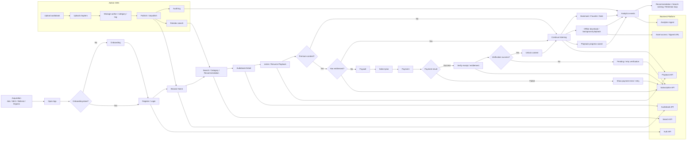
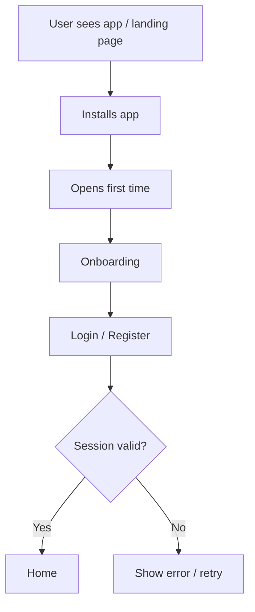
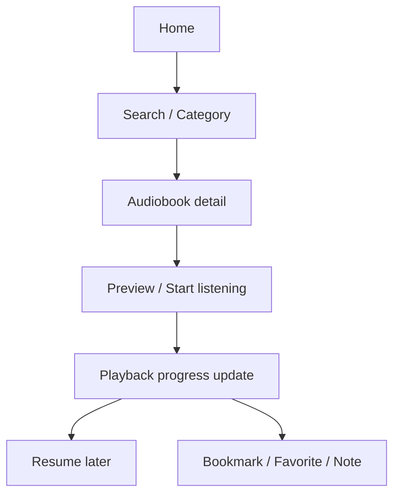
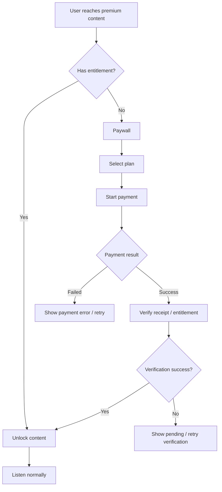
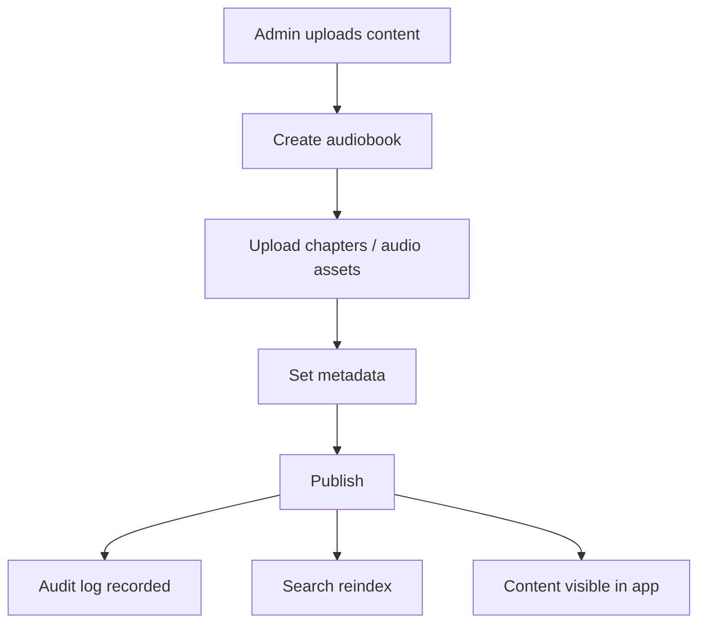
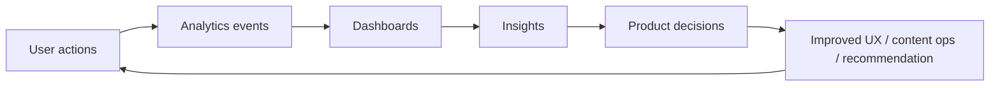

# Business Flow Diagram

Tài liệu này mô tả luồng kinh doanh tổng thể của nền tảng audiobook / audio learning, tập trung vào:

- Tạo thói quen nghe
- Tăng retention
- Tăng chuyển đổi subscription
- Giảm friction khi tìm và nghe nội dung
- Hỗ trợ vận hành content qua CMS

## 1. Business Flow Tổng Quan

## 2. Luồng Kinh Doanh Chi Tiết

### 2.1 Acquisition -> Activation

Mục tiêu của giai đoạn này:

- Giảm số bước trước khi người dùng vào được nội dung
- Đưa người dùng tới màn Home nhanh nhất có thể
- Tăng activation rate sau cài đặt

### 2.2 Discovery -> Playback

Mục tiêu của giai đoạn này:

- Tăng average listening time
- Tăng completion rate
- Giảm ma sát khi resume
- Kích thích hành vi lưu lại nội dung học tập

### 2.3 Monetization

Mục tiêu của giai đoạn này:

- Tăng free-to-paid conversion
- Giảm drop-off tại paywall
- Bảo vệ premium content
- Tách rõ payment success với entitlement unlock
- Cho phép verify lại receipt trước khi mở nội dung premium

### 2.4 Content Operations

Mục tiêu của giai đoạn này:

- Giảm công vận hành content
- Đảm bảo nội dung publish nhanh và nhất quán
- Giữ chất lượng metadata để discovery tốt hơn

### 2.5 Analytics Feedback Loop

Event cần track:

- `app_opened`
- `audiobook_viewed`
- `chapter_started`
- `chapter_completed`
- `playback_paused`
- `playback_resumed`
- `bookmark_created`
- `subscription_started`
- `subscription_cancelled`

## 3. Điểm Chạm Theo Vai Trò

| Vai trò | Hành động chính | Kết quả kinh doanh |
|---|---|---|
| User | Browse, search, nghe, bookmark, upgrade | Retention, engagement, subscription |
| Admin | Upload, publish, quản lý taxonomy | Content quality, vận hành hiệu quả |
| Backend | Auth, playback, subscription, search, analytics | Ổn định hệ thống, giảm friction |
| Analytics | Ghi nhận hành vi, tạo insight | Tối ưu retention và conversion |

## 4. KPI Liên Quan

Sơ đồ này hỗ trợ các KPI sau:

- DAU / MAU
- Average listening time
- Day 1 / Day 7 / Day 30 retention
- Free-to-paid conversion rate
- Churn rate
- Completion rate per audiobook

## 5. Ghi chú Thiết Kế

- Luồng ưu tiên là `browse -> detail -> listen -> resume`
- Paywall chỉ nên xuất hiện khi thực sự chạm premium content hoặc entitlement check
- Publish content phải trigger reindex để search phản ánh đúng dữ liệu mới
- Analytics không được block trải nghiệm nghe
- Signed URL và CDN URL phải được cấp qua backend, không expose raw storage URL
